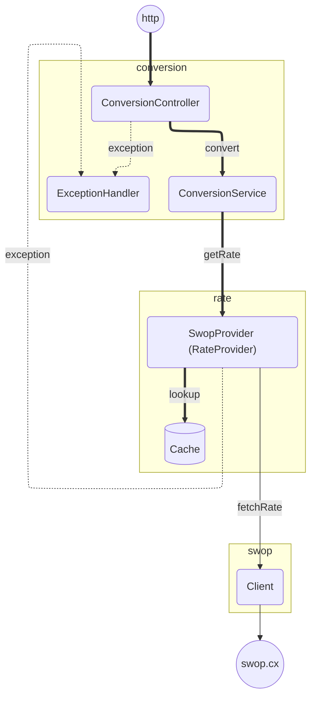
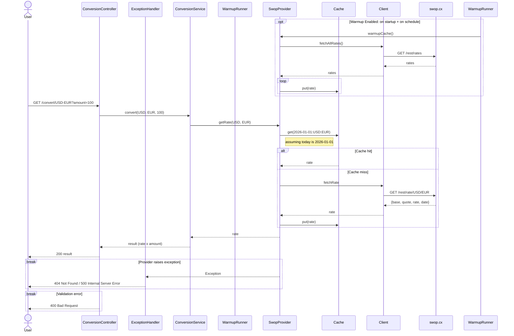

# Backend

## Architecture

The codebase follows a **layered architecture** with classes grouped into packages by **domain**.





### Input Validation

- **Currency codes**: Validated against `java.util.Currency` (ISO 4217 standard)
- **Amount**: Constrained via Jakarta Validation (`@DecimalMin`, `@DecimalMax`, `@Digits`)
  - Range: `0.01` to `100,000,000,000`
  - Maximum 2 decimal places

## Technology Choices

### RESTful API vs GraphQL

GraphQL would require additional solutions for serializing and managing response payloads. For an application with few routes and resources, this adds unnecessary complexity with little benefit. REST provides simpler integration as boilerplate provided by the framework already.

### Caffeine over Native Caching

Caffeine provides built-in cache eviction policies (TTL, size limits) and metric collection (`hitRate`, `evictionCount`) without requiring custom implementation. This accelerates development compared to managing a `ConcurrentHashMap` manually.

## Caching Design

**Cache key format**: `date:from:to` (e.g., `2026-02-24:USD:EUR`)

- Date component enables automatic invalidation when the day changes
- TTL: 24 hours - in the most extreme case there will be 2 sets of keys living simultaniously: for current and previous day
- Maximum estimated keys: ~35,000 (combination of ~180 currencies × 2)

**Warmup strategy**:
1. **On startup** — `ApplicationRunner` fetches all available rates asynchronously
2. **Daily refresh** — `@Scheduled` cron job runs at 00:00:01 UTC

Controlled via `forex.cache.warmup.enabled` (default: `true`).

> [!NOTE]
> Redis can be added as a drop-in distributed cache replacement for production deployments, which would be particularly useful with multi-pod deployments for shared memory capability. In this case cache warmup could be reworked as a micro-deployment separate from the main application so there is no multiple warmups of a single shared storage.

## Error Handling

Exception handling is placed to `conversion` package. While it's not completely ideomatic pattern, in this particular case we only have one controller and exceptions aren't shared.

| Exception | HTTP Status | Response |
|-----------|-------------|----------|
| `IllegalArgumentException` | 400 | "Invalid currency code: ..." |
| `ProviderRateNotFoundException` | 404 | "Rate not found" |
| `ConstraintViolationException` | 400 | Validation message |
| `ProviderException` (client/server errors) | 500 | Provider error message |
| Unhandled exceptions | 500 | "An unexpected error occurred" |

All error responses follow a consistent format: `{"error": "message"}`

## Configuration Philosophy

- **`application.yml`**: Production-ready defaults
- **`application-{profile}.yml`**: Environment-specific overrides (dev, test)
- Secrets injected via environment variables (`${VARIABLE_NAME}`)

## Testing

Besides typical unit tests 

```bash
./gradlew test -P unit
```

application API is covered with (functional) integration tests.

```bash
./gradlew test -P integration
```

Overal test coverage of the project shouldn't be below 80%, coverage could be checked with:

```bash
./gradlew test jacocoTestReport
```
